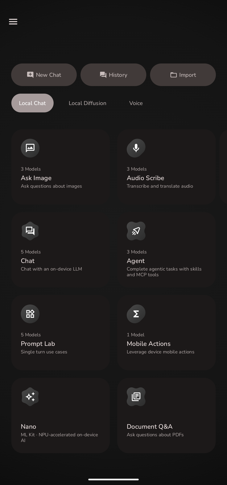
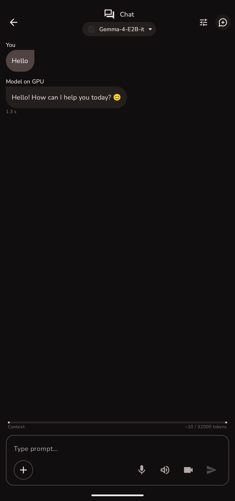
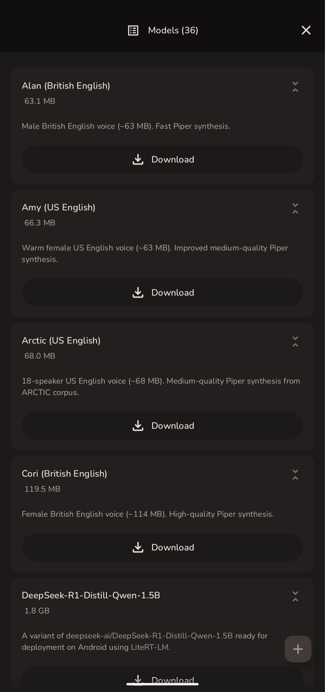
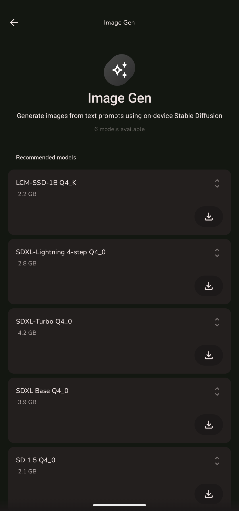
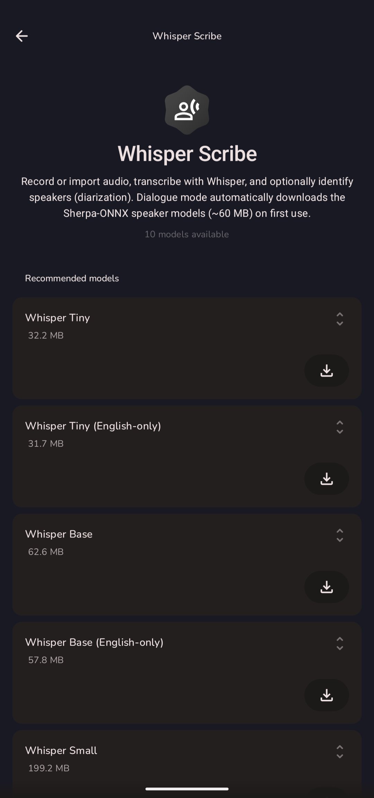
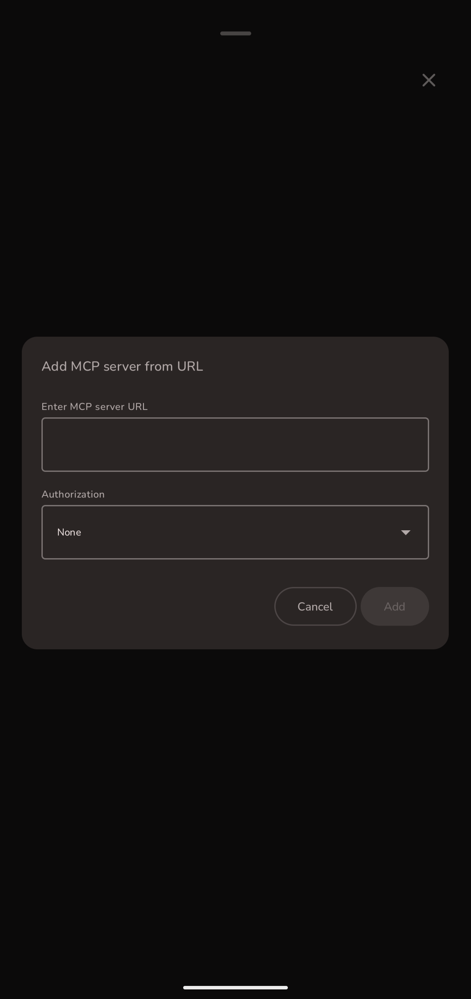

# Google AI Edge Gallery

An Android app that runs open-source language, image and speech models on the device,
offline.

This repository is a fork of [`google-ai-edge/gallery`](https://github.com/google-ai-edge/gallery),
merged with [`jegly/Box`](https://github.com/jegly/Box). Google's project provides the
app, the LiteRT runtime and the model catalogue. The Box fork added image generation,
audio transcription and GGUF inference. This fork adds an OpenAI-compatible API server,
model discovery on HuggingFace and an app lock. The app name, application id and package
are unchanged from upstream. Upstream changes are merged with the workflows described in
[DEVELOPMENT.md](DEVELOPMENT.md).

## Install

This fork has no releases and is not on any app store. Build it from source. See
[DEVELOPMENT.md](DEVELOPMENT.md). The app needs Android 12 or later on an arm64 device.

The Play Store and App Store carry Google's build of the upstream app. That build does
not include the features added by the Box fork or by this fork.

## App Preview

| Home | AI Chat | Model Manager |
|:--:|:--:|:--:|
|  |  |  |

| Image Generation | Audio Transcription | MCP Server |
|:--:|:--:|:--:|
|  |  |  |

## Core Features

* **AI Chat with Thinking Mode**: Multi-turn conversation. Thinking Mode shows the
  model's reasoning steps on models that support it, starting with the Gemma 4 family.

* **Agent Skills and MCP**: Give the model tools. Bundled skills add Wikipedia lookup,
  maps and summary cards, and you can load a skill from a URL. MCP connects the model
  to an external server. See [skills/README.md](skills/README.md) and
  [mcp/README.md](mcp/README.md).

* **Ask Image**: Describe an image or answer a question about it from the camera or the
  photo gallery, on models with image input.

* **Audio Scribe**: Transcribe and translate voice recordings with on-device models.

* **Prompt Lab**: Test single-turn prompts with control over temperature, top-k and
  top-p.

* **Mobile Actions**: Control device functions from natural language with a finetune of
  FunctionGemma 270m.

* **Tiny Garden**: A game that plants and harvests a virtual garden from natural
  language, with a finetune of FunctionGemma 270m.

* **Model Management and Benchmark**: Download models from the catalogue or import your
  own, and measure how each model performs on your hardware.

* **Image Generation**: Generate images with stable-diffusion.cpp. Added by the Box fork.

* **Audio Transcription**: Transcribe audio with whisper.cpp. Added by the Box fork.

* **GGUF Models**: Run GGUF models with llama.cpp, beside the LiteRT models from the
  catalogue. Added by the Box fork.

* **Chat History**: Save conversations and resume them later. Added by the Box fork.

* **API Server**: An OpenAI-compatible HTTP server on the device, with chat completions,
  transcription, image generation and vision endpoints behind a bearer token. Added by
  this fork.

* **Model Discovery**: Search HuggingFace for LiteRT and GGUF models from inside the app.
  Added by this fork.

* **App Lock**: A biometric lock, encrypted storage and an offline mode. Added by this
  fork.

* **On-Device Inference**: All inference runs on the device. The app uses the network
  to download models and the model catalogue, and for any MCP server or skill you
  configure.

## Get Started

1. Check the OS requirement: Android 12 or later, arm64.
2. Build and install the app. See [DEVELOPMENT.md](DEVELOPMENT.md).
3. Open the app and download a model from a task page or from the Model Manager.

For a user guide, see the [upstream project wiki](https://github.com/google-ai-edge/gallery/wiki).
It documents the upstream app. The features added by the Box fork and by this fork are
not covered there.

## Technology

* **Google AI Edge** and **LiteRT**: On-device model execution for `.litertlm` models.
* **llama.cpp**, **stable-diffusion.cpp** and **whisper.cpp**: Native modules for GGUF
  inference, image generation and transcription.
* **Hugging Face**: Model discovery and download.

## Development

See [DEVELOPMENT.md](DEVELOPMENT.md) for the build, the submodules and upstream syncing.

## Feedback

* Found a bug? [Open an issue](../../issues/new?labels=bug).
* Have an idea? [Open an issue](../../issues/new?labels=enhancement).

## License

Apache License, Version 2.0. See [LICENSE](LICENSE).

## Links

* [Upstream project wiki](https://github.com/google-ai-edge/gallery/wiki)
* [Hugging Face LiteRT Community](https://huggingface.co/litert-community)
* [LiteRT-LM](https://github.com/google-ai-edge/LiteRT-LM)
* [Google AI Edge Documentation](https://ai.google.dev/edge)
